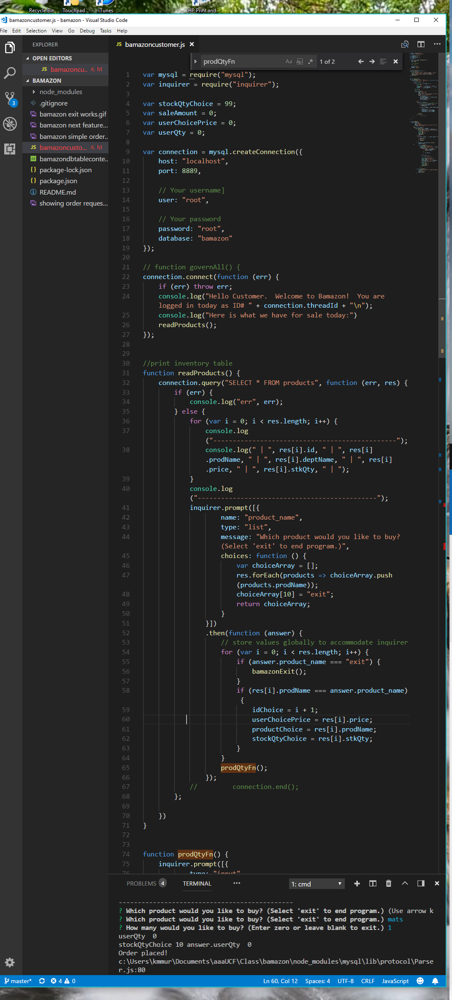

bamazon
=======

UCF Full Stack Bootcamp Week 6 homework, Node.js, npm inquirer, mySQL, DB query

This was an exercise to demonstrate node.js, JavaScript & mySQL. Node required
“mySQL” library to accommodate database manipulation and “inquirer” to generate
console output and accept console input.

The logic for handling and tracking items, inventory & prices was fairly
straightforward. In order to smooth out development and testing of the code,
data validation was left until the end. While this code 100% meets the stated
requirements, there is still room for improvement. A prime area for this
improvement would require multiple additional inquirer.prompts and promises.
Given a more leisurely deadline (or maybe after the bootcamp is over), these can
be constructed and applied to improve the professionalism of the solution.

The mySQL portion of this exercise was the highlight for me as I feel my
background in engineering, mathematics and statistics –on top of this bootcamp
–will combine to make me capable not only of building and managing databases but
also ready and able to determine if and how the data can be applied to generate
meaningful (and therefore monetizable) conclusions from this data.

The repo for all the code is fully up to date now. Videos suitable for
demonstrating functionality are on the repo.

Here are the original instructions, now with notations:

Instructions
------------

### Challenge \#1: Customer View (Minimum Requirement)

1.  Create a MySQL Database called `bamazon`. --DONE

2.  Then create a Table inside of that database called `products`. --DONE

3.  The products table should have each of the following columns: --all DONE

-   item_id (unique id for each product)

-   product_name (Name of product)

-   department_name

-   price (cost to customer)

-   stock_quantity (how much of the product is available in stores)

1.  Populate this database with around 10 different products. (i.e. Insert
    "mock" data rows into this database and table). --DONE

2.  Then create a Node application called `bamazonCustomer.js`. Running this
    application will first display all of the items available for sale. Include
    the ids, names, and prices of products for sale. -- --DONE

3.  The app should then prompt users with two messages. -- --both DONE

-   The first should ask them the ID of the product they would like to buy. --
    --DONE (did one better and accepted the product name instead…)

-   The second message should ask how many units of the product they would like
    to buy. --DONE

1.  Once the customer has placed the order, your application should check if
    your store has enough of the product to meet the customer's request. --
    --DONE

-   If not, the app should log a phrase like `Insufficient quantity!`, and then
    prevent the order from going through.

1.  However, if your store *does* have enough of the product, you should fulfill
    the customer's order. -- --DONE

-   This means updating the SQL database to reflect the remaining quantity.
    --DONE

-   Once the update goes through, show the customer the total cost of their
    purchase.

-   If this activity took you between 8-10 hours, then you've put enough time
    into this assignment. Feel free to stop here -- unless you want to take on
    the next challenge.

-   \---this was plenty, thank you…finishing up this readme at 11:30pm Monday

\---see screenshot of code on next page (which is also posted in the repo)

